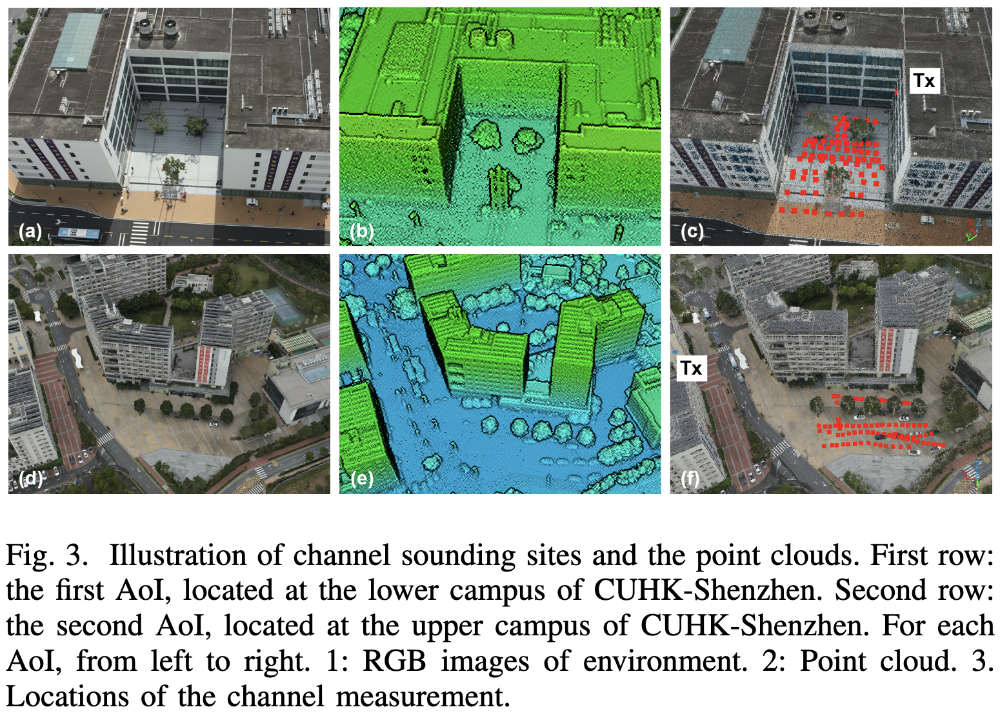

# CKM-Dataset
This repository hosts our **Channel Knowledge Map (CKM) Dataset**, collected through extensive real-world measurement campaigns on the campus of The Chinese University of Hong Kong, Shenzhen. The dataset is designed to support research in **wireless communications, channel modeling, and environment-aware AI methods for 6G and beyond**.

## Key Features

- **Joint Channel–Environment Data**: Includes measured **Channel Impulse Responses (CIRs)**, **Power Delay Profiles (PDPs)**, and **Received Signal Strength (RSS)** values.  
- **3D Environment Information**: High-resolution **point cloud data** of the measurement area, enabling joint geometry–propagation modeling.  
- **High Temporal Resolution**: Measurements captured at **0.4 ns resolution (2.4 GSps)** for fine-grained multipath analysis.  
- **Accurate Positioning**: Measurement locations determined with **centimeter-level accuracy using RTK**, overcoming the limitations of standard GPS.  
- **Extensive Coverage**: Hundreds of transmitter–receiver points across outdoor and semi-urban scenarios resembling realistic city environments.  

## Availability

We have uploaded a portion of the dataset, which can be downloaded [here](https://cuhko365-my.sharepoint.com/:f:/g/personal/220019053_link_cuhk_edu_cn/EtC66WQ0QntAh1A3Qmb9lgwBYtJHdLQTBZa8KLmPOBSOrw?e=hTZcpm).

The remaining data will be made available soon as we continue to organize and release the full dataset.

## Acknowledgement
Please acknowledge the following paper if the dataset is useful for your research.

@article{wang2025towards,
  title={Towards Precise Channel Knowledge Map: Exploiting Environmental Information from 2D Visuals to 3D Point Clouds},
  author={Wang, Yancheng and Huang, Chuan and Zhang, Songyang and Chen, Guanying and Guo, Wei and Lan, Shenglun and Xu, Lexi and Cheng, Xinzhou and Tang, Xiongyan and Cui, Shuguang},
  journal={arXiv preprint arXiv:2510.08140},
  year={2025}
}